# Тестування працездатності системи

### Засіб тестування

[Postman](https://www.postman.com/product/what-is-postman/)

### Таблиці, до яких здійснювався доступ

- permission
- right
- role
- user

### Початкове наповнення бази даних

#### permission

    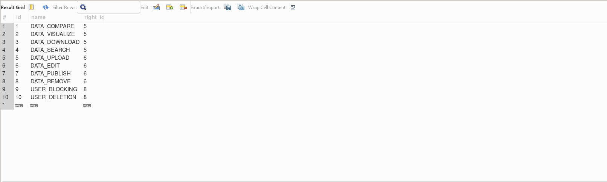

#### right

    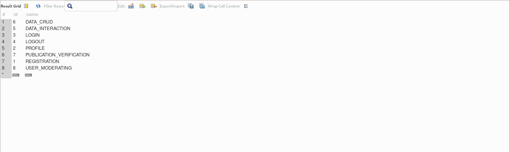

#### role

    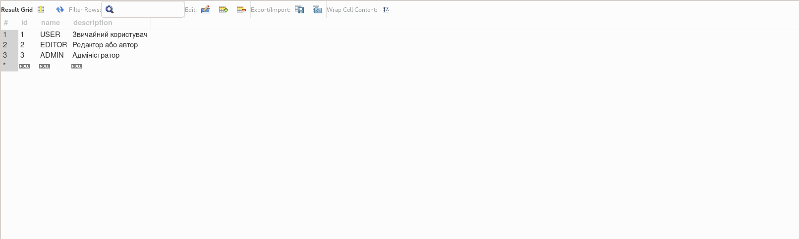

#### user

    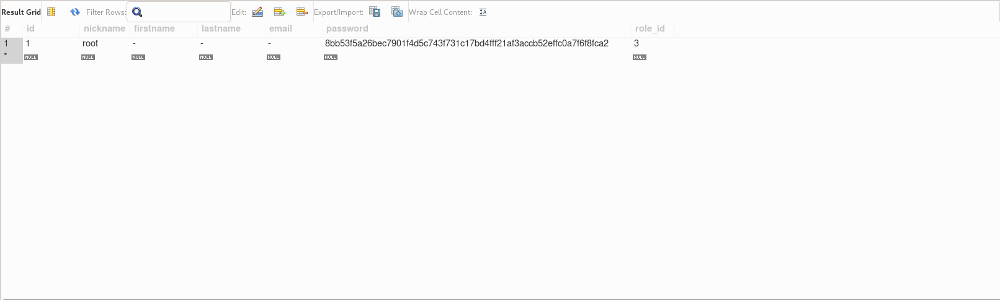

## Перегляд довідкової інформації

### Системні дозволи

    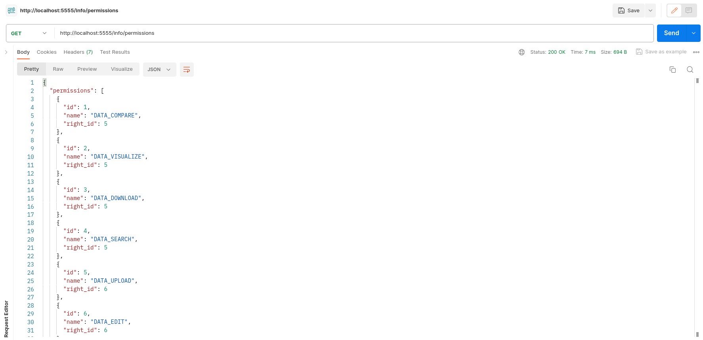

### Конкретний системний дозвіл

    

### Системні права

    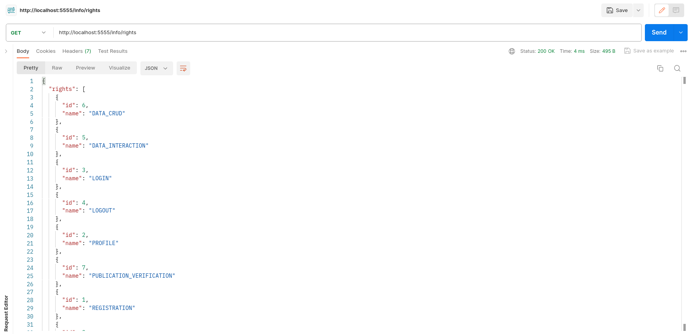

### Конкретне системне право

    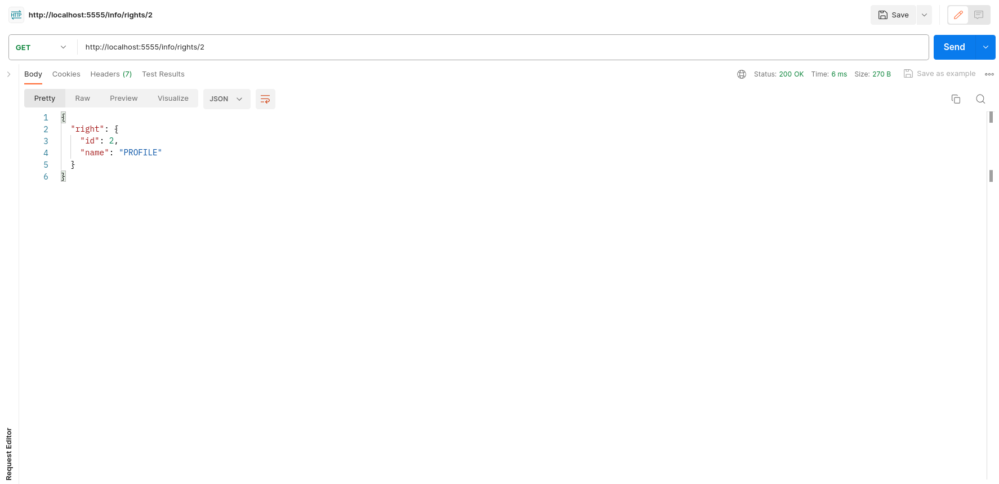

### Системні ролі

    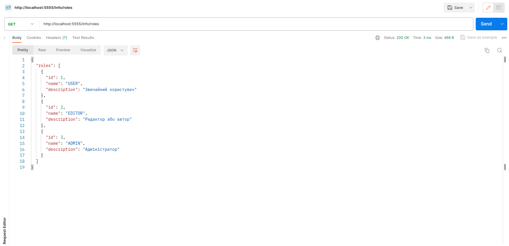

### Конкретна системна роль

    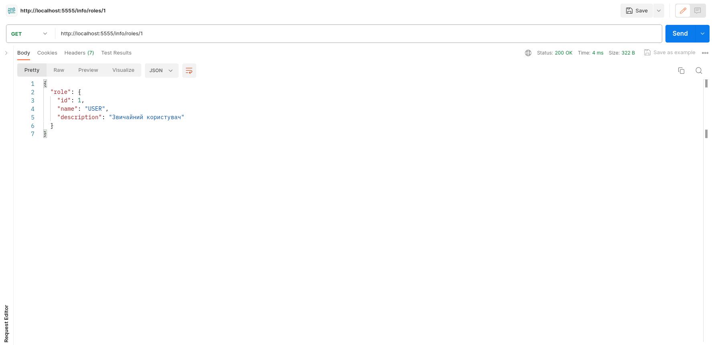

## Створення нового користувача

    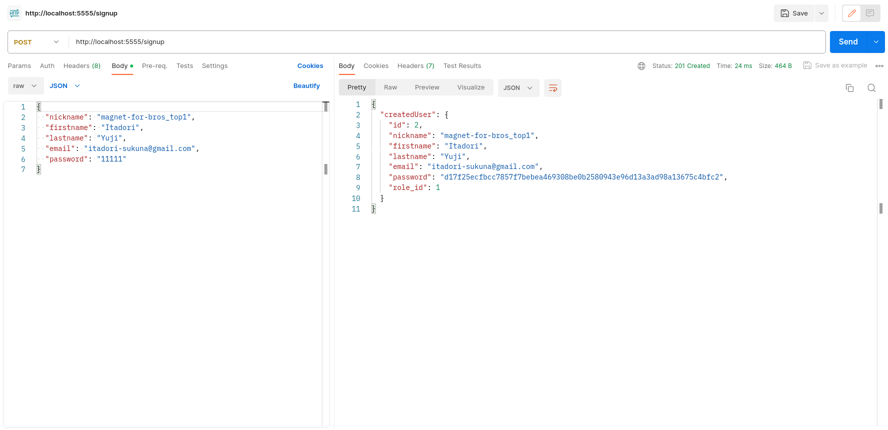

## Автентифікація

#### Якщо поточний користувач ще не автентифікований

    

#### Якщо поточний користувач уже автентифікований

    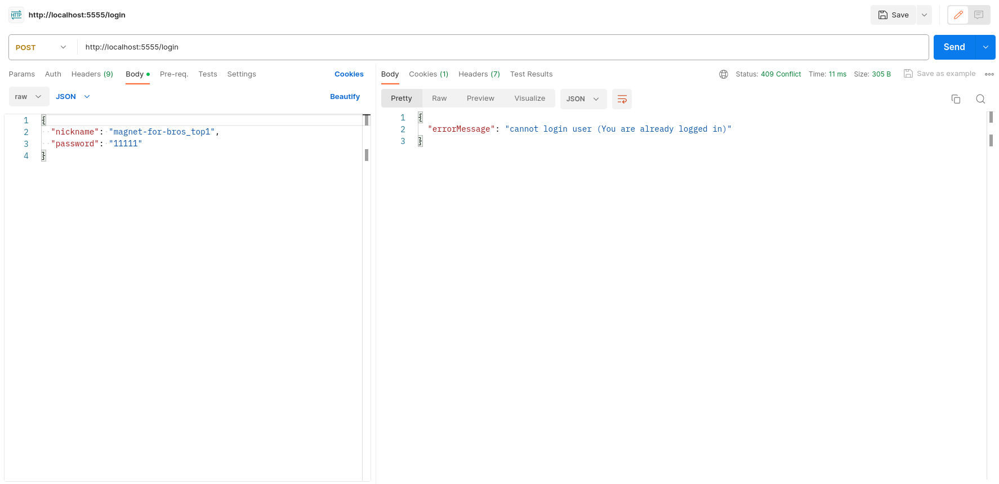

## Завершення сесії

#### Якщо поточний користувач автентифікований

    

#### Якщо поточний користувач ще не автентифікований

    

## Отримання списку зареєстрованих користувачів

#### Як авторизований користувач

    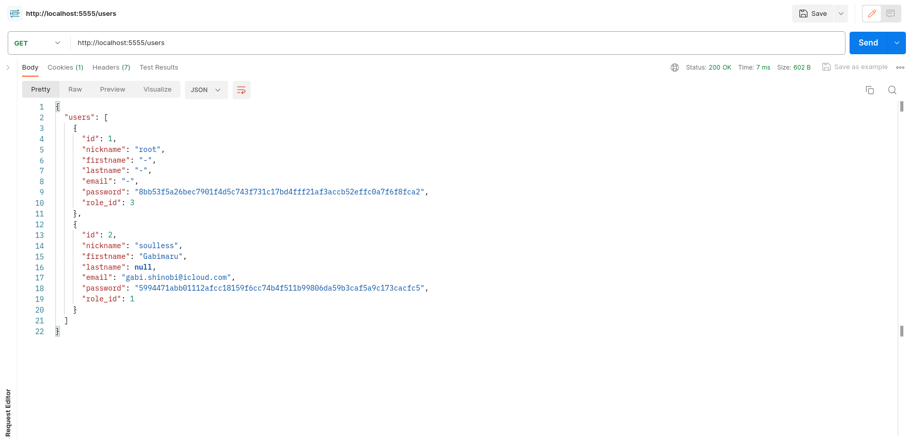

#### Як неавторизований користувач

    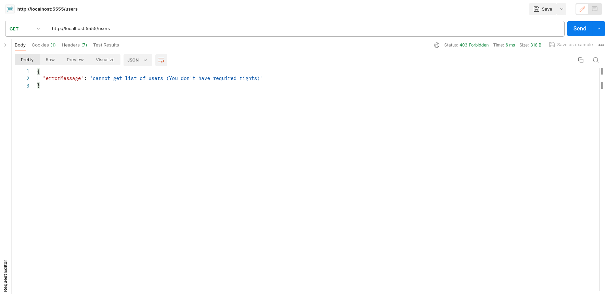

## Отримання інформації про конкретного зареєстрованого користувача

#### Як авторизований користувач

    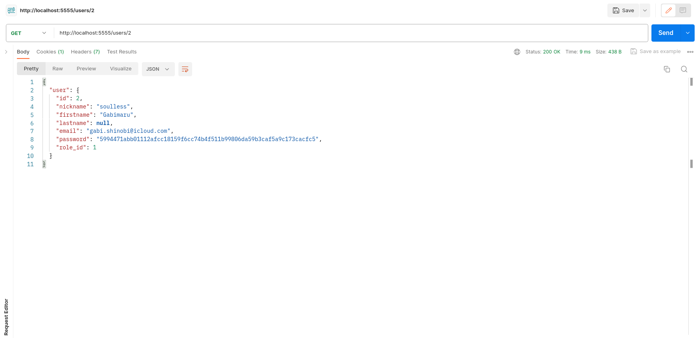

#### Як неавторизований користувач

    

## Отримання розширеної інформації про конкретного зареєстрованого користувача

#### Як авторизований користувач

    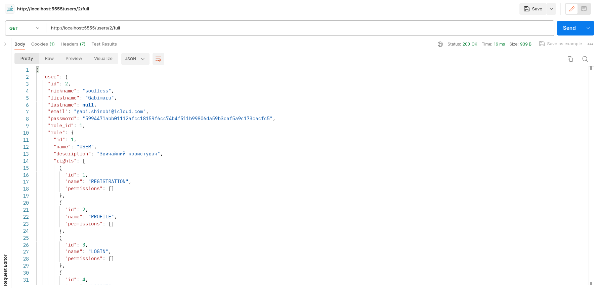

#### Як неавторизований користувач

    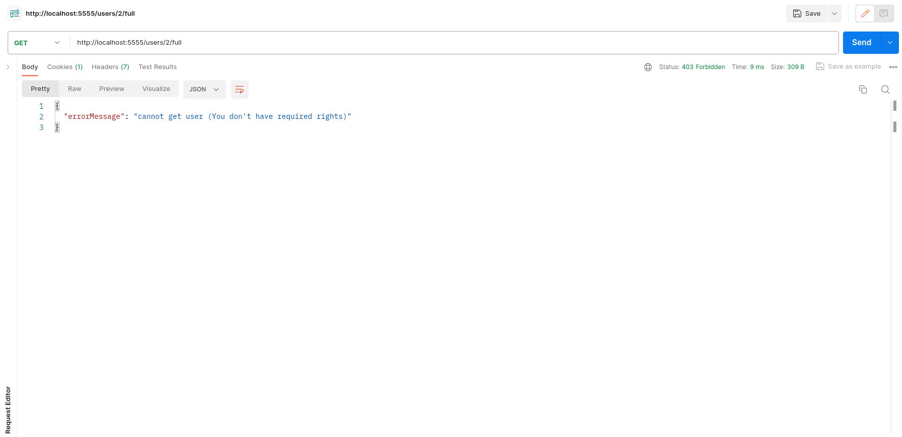

## Оновлення персональних даних поточного користувача
#### Якщо поточний користувач автентифікований

    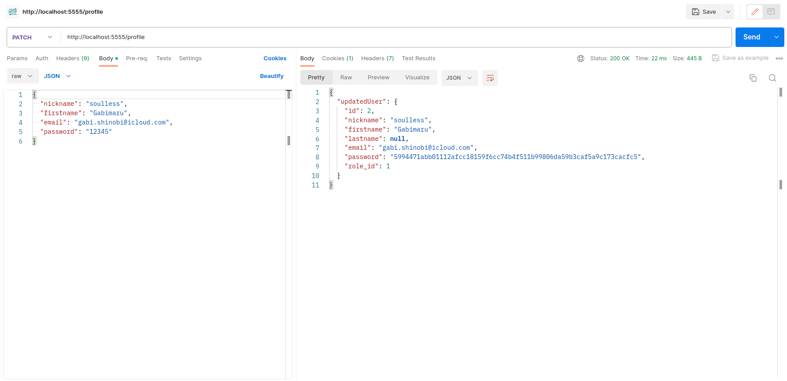

#### Якщо поточний користувач не автентифікований

    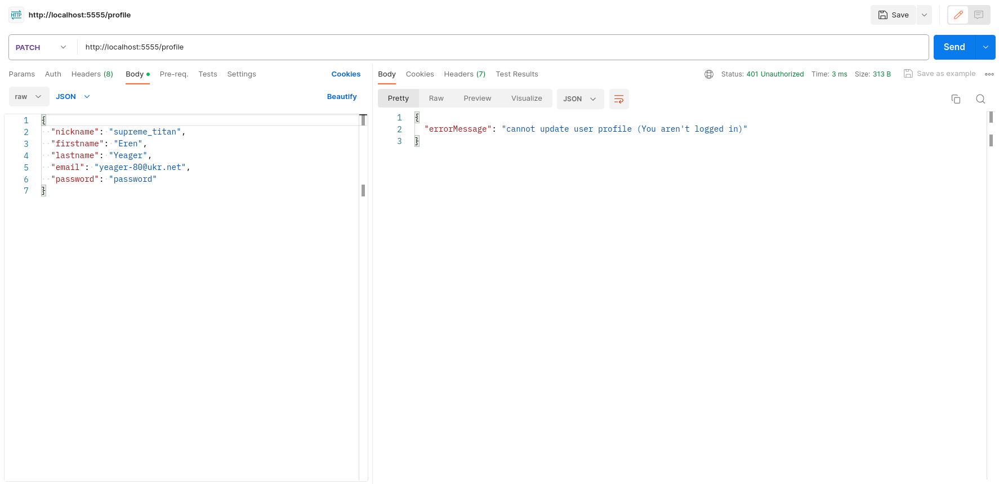

## Зміна ролі зареєстрованого користувача

#### Як авторизований користувач

    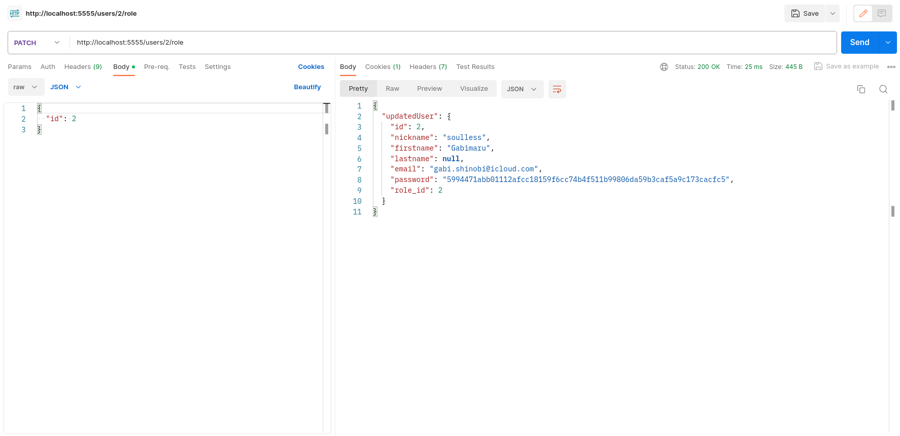

#### Як неавторизований користувач

    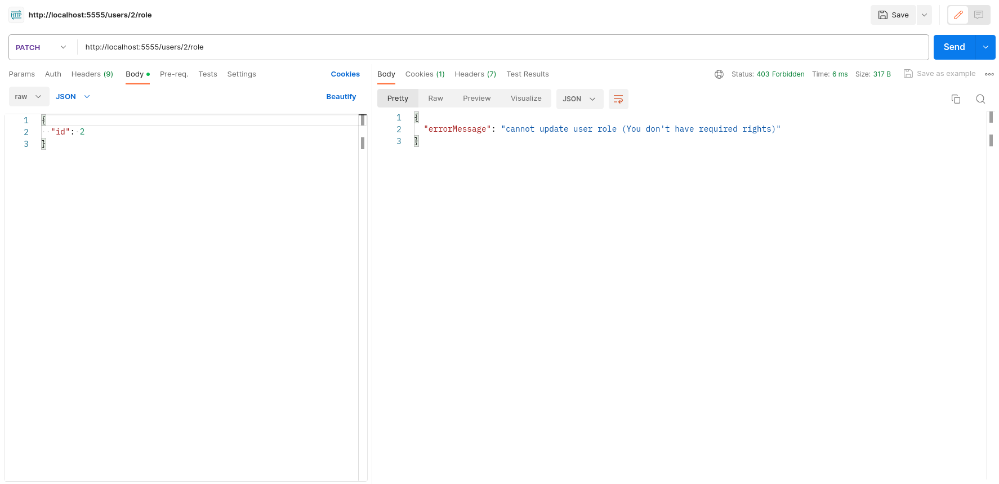

## Видалення зареєстрованого користувача

#### Як авторизований користувач

    

#### Як неавторизований користувач

    

